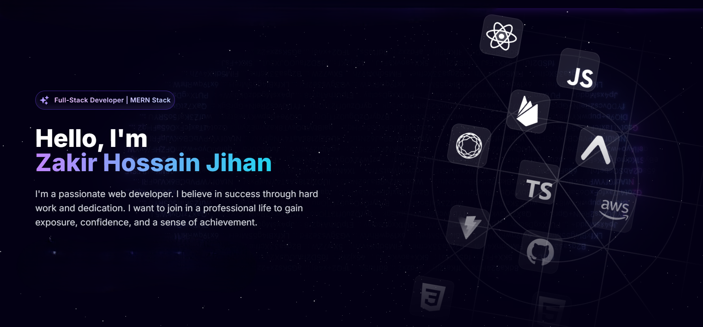

  

###
 

# 💻 Tech Stack:
                          
# 📊 GitHub Stats:

###

<picture>
  <source media="(prefers-color-scheme: dark)" srcset="https://raw.githubusercontent.com/ZH-Jihan/ZH-Jihan/output/pacman-contribution-graph-dark.svg">
  <source media="(prefers-color-scheme: light)" srcset="https://raw.githubusercontent.com/ZH-Jihan/ZH-Jihan/output/pacman-contribution-graph.svg">
  
</picture>

###

 

## 🏆 GitHub Trophies

---

###
